# SuRaksha Sentinel

<p align="center">
  
  
  
  
</p>

<p align="center">
  
  
  
  
  
  
</p>

<p align="center">
  <b>Canara-inspired explainable underwriting intelligence for real-time document, source, entity, and fund-flow anomaly detection.</b>
</p>

<p align="center">
  <a href="#the-prototype-story">Story</a> |
  <a href="#live-ui-surfaces">UI</a> |
  <a href="#how-the-demo-feels">Demo Flow</a> |
  <a href="#architecture">Architecture</a> |
  <a href="#ai-core">AI Core</a> |
  <a href="#run-locally">Run Locally</a> |
  <a href="#operational-workarounds-and-fallbacks">Fallbacks</a> |
  <a href="#validation">Validation</a>
</p>

SuRaksha Sentinel is a full-stack hackathon prototype for the SuRaksha Cyber Hackathon Theme 1 challenge: detecting tampering, changes, and forgery attempts across land records, legal documents, and financial statements in real time, then converting that evidence into reliable underwriting insight. The project is built as a Canara-familiar intelligence workbench rather than a generic fraud dashboard. It speaks in the language of branch underwriting, borrower verification, collateral due diligence, public-source risk, compliance trails, and human review.

This repository does not claim access to Canara Bank internal systems, internal data, production transaction streams, or non-public architecture. The Canara alignment is intentionally limited to public-facing digital banking patterns, public Canara material, public regulator/security sources, and a local demo environment that makes the Theme 1 workflow concrete. All demo registry and transaction facts are marked as local demo data, while live public connectors expose provenance, freshness, and degraded states instead of pretending stale data is live.

The visuals in this README are stack badges, Mermaid diagrams, and real screenshots/GIF frames captured from the running local prototype. They are included to show the implemented interface, not to imply production Canara access or fictional UI states.

## Live UI Surfaces

The screenshots in this section are captured from the running local prototype at `http://127.0.0.1:5173` with the backend active at `http://127.0.0.1:8001`. They are included so the repository shows the actual implemented interface rather than only describing the intended experience. The values shown in the screenshots are live prototype state and can change as the backend emits new snapshots, connector freshness changes, and the selected case rotates.

The Command Center is the first operator surface. It presents the Canara-inspired navigation, active underwriting desk, live source ticker, case selector, Qwen readiness, primary workflow actions, Sentinel Risk Index, source freshness, and public-system benchmark mapping. This is the entry point for evaluators who need to understand the branch context before drilling into documents or source intelligence.

<p align="center">
  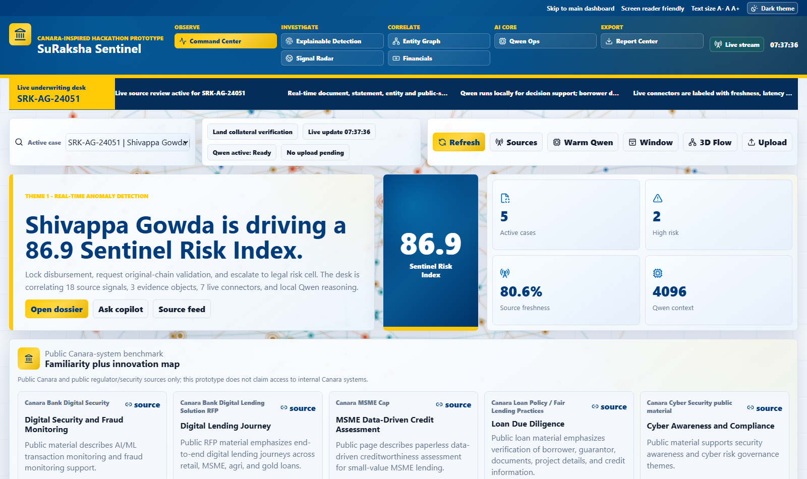
</p>

The Explainable Detection surface is the primary Theme 1 workbench. It shows the loan-profile specific ingestion stage, required document set, progress stream, composite risk gauge, and the start of the synchronized document-and-reasoning workflow. This view is where the prototype demonstrates that the anomaly pipeline is tied to underwriting context rather than a generic upload screen.

<p align="center">
  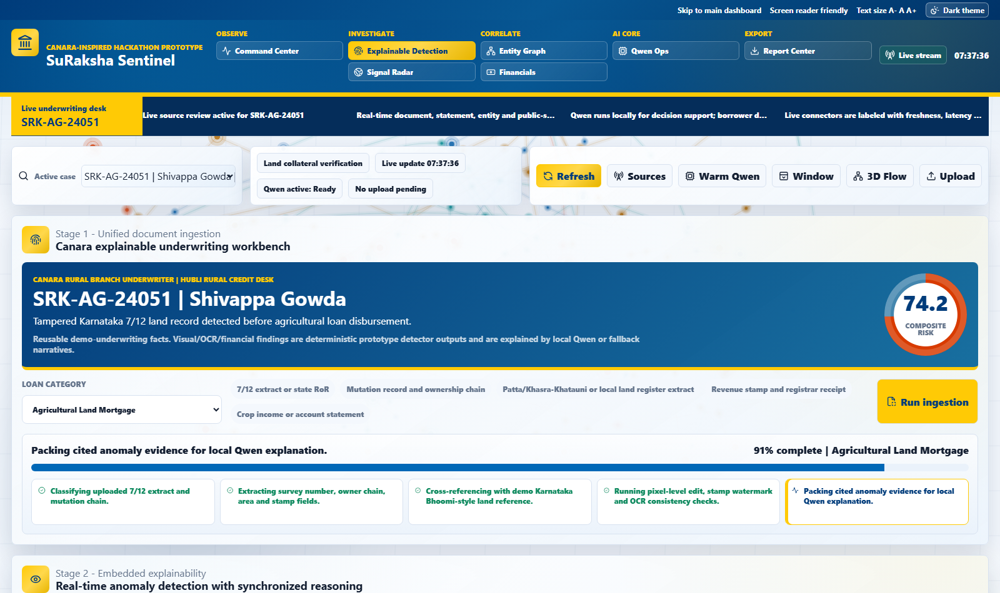
</p>

The Financials workspace carries the 3D fund-flow investigation surface. It uses local demo transaction data derived from dossier context, not production bank transactions, and renders a live risk-colored Three.js scene with transaction paths, path selection, risk floor control, and Qwen flow explanation actions. The point of this screen is to connect document risk with suspicious financial movement in a way that a flat table cannot.

<p align="center">
  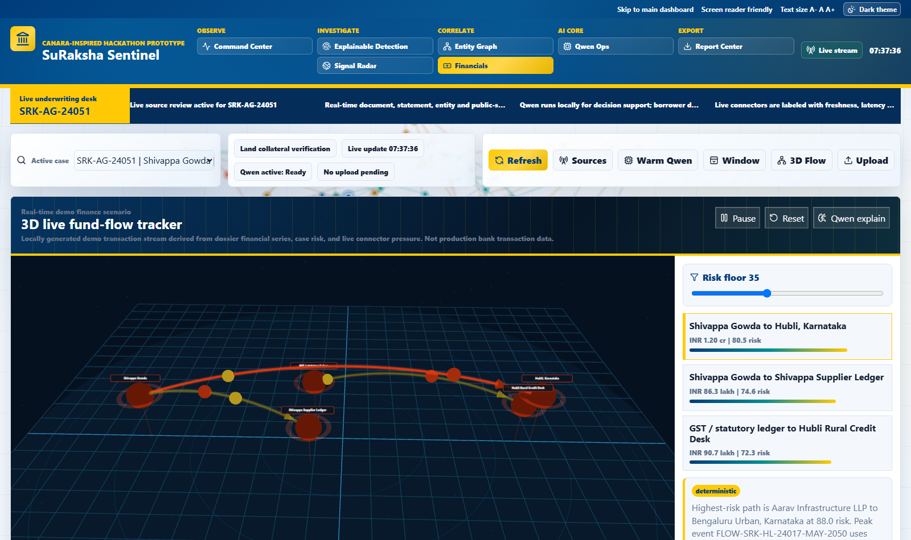
</p>

The short animation below is generated from real captured Financials frames. It is intentionally compact for the README, but it shows the live 3D fund-flow scene as an animated investigative surface rather than a static diagram.

<p align="center">
  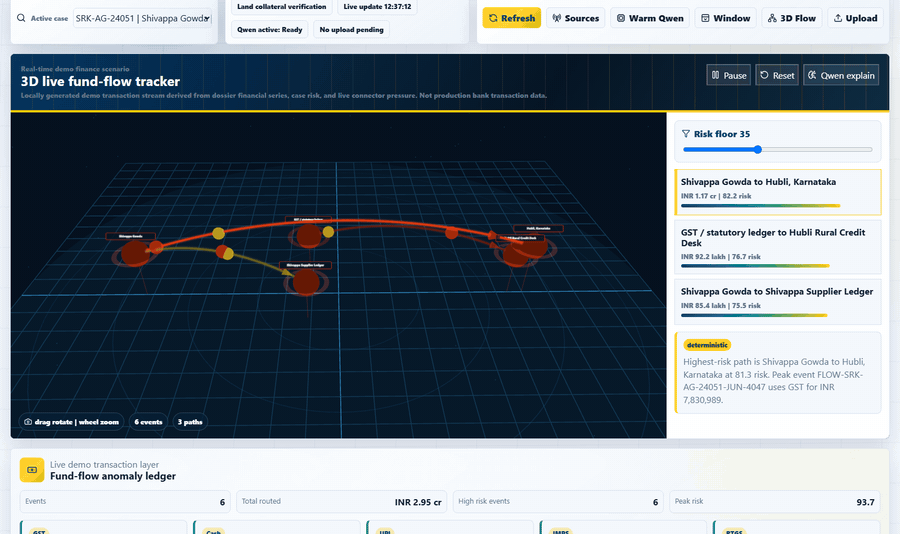
</p>

The Signal Radar surface shows the public-source media and intelligence layer. Its media wall is generated from backend source resolution, connector outputs, source profile cards, video thumbnails, image previews, and PDF/circular representations. It is intentionally visible because the prototype should not feel like it is hiding behind static placeholder cards.

<p align="center">
  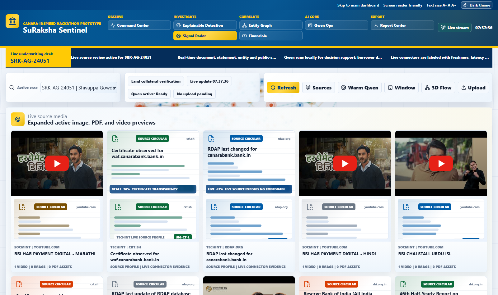
</p>

The graph and map screenshots below show the supporting intelligence layer behind the document workflow. Entity Graph combines a 3D relationship surface with a 2D evidence graph and path review, while the geo risk map keeps collateral geography visible through live coordinate-based risk markers and map-tile fallback behavior.

<p align="center">
  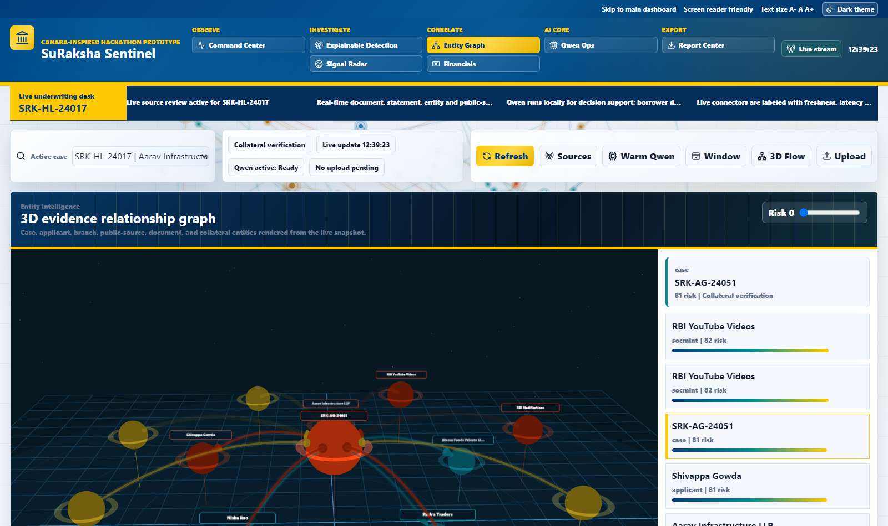
</p>

<p align="center">
  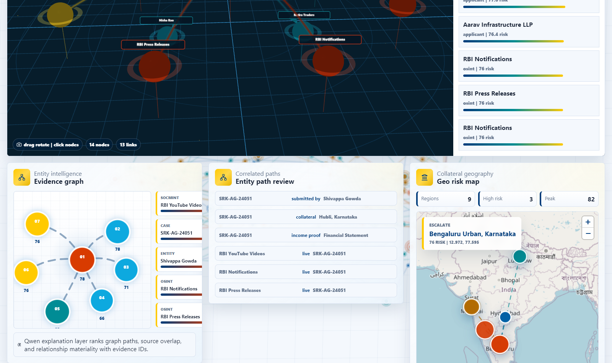
</p>

The 2D evidence graph gives a denser read of path materiality and source overlap when a reviewer does not need the full 3D canvas. It is kept beside the map and path review so collateral geography, entity relationships, and source evidence remain in the same investigative frame.

<p align="center">
  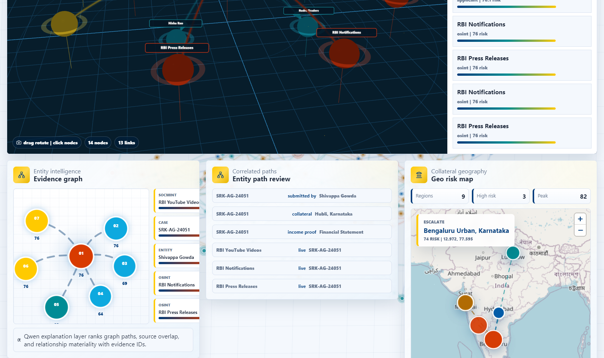
</p>

The charting layer is captured from the Financials workspace. It includes a cash-flow anomaly line chart, a month-by-month stress strip, the detector/Qwen/source consensus matrix, and materiality category scoring. These views are meant to make the analytical evidence visible in the README instead of only describing it in text.

<p align="center">
  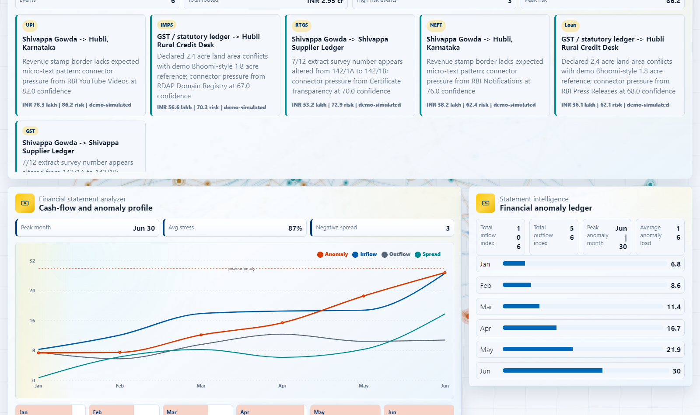
</p>

<p align="center">
  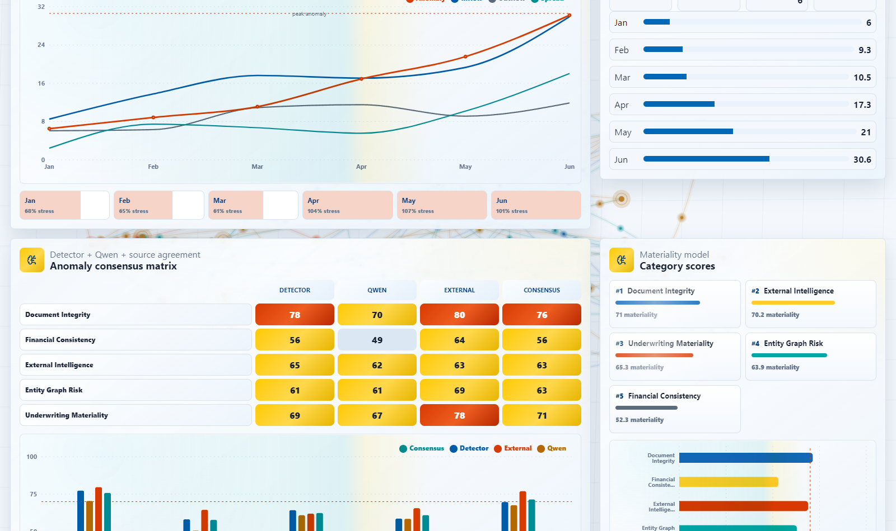
</p>

<p align="center">
  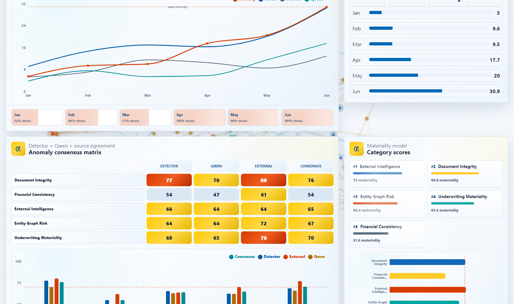
</p>

The ledger view closes the financial story by showing individual generated demo transaction events with channel, amount, risk, materiality, and provenance labels. The data is local demo simulation derived from dossier and connector pressure; it is not represented as production bank transaction data.

<p align="center">
  
</p>

## The Prototype Story

Indian underwriting often depends on a mixed document set: land records, sale deeds, legal declarations, bank statements, GST references, invoices, guarantor proofs, and public-source corroboration. A single forged survey number, altered statement total, manipulated stamp, or circular transaction can change the credit decision. The central idea behind SuRaksha Sentinel is that a bank underwriter should not only see that a risk has been flagged; they should see why it was flagged, which evidence supports it, how confident the system is, what source-of-truth trace was used, and what human action should happen next.

The prototype therefore treats anomaly detection as an explainable workflow rather than a black-box prediction. Deterministic local services generate evidence facts such as document regions, source traces, financial series, flow paths, media previews, connector states, and audit events. Local Qwen 3.5 4B then acts as the reasoning and narrative layer that turns those facts into concise explanations, underwriting memos, counterfactual summaries, and agent responses. This keeps the model focused on what it can do well in a local 4B deployment: grounded reasoning over compact evidence packs.

At the UI level, the system is designed as a professional banking workbench. The Command Center gives the portfolio posture and active case context. The Explainable Detection tab is the primary Theme 1 experience, showing ingestion, document overlays, anomaly explanations, decomposable risk, and tamper-evident audit history. Signal Radar adds public-source intelligence with media previews and provenance. Entity Graph and Financials bring the relationship and fund-flow surfaces, including Three.js scenes for 3D transaction and entity analysis. Qwen Ops exposes the model runtime rather than hiding it, because the model is supposed to be the core local intelligence engine. Report Center turns the entire investigation into a reviewer-ready package.

## How The Demo Feels

The evaluator opens the application as a branch underwriter and lands in a Canara-inspired command surface. The first view communicates the active case, the current Sentinel Risk Index, the connected public sources, the state of the local Qwen runtime, and the benchmark map that explains how the prototype improves familiar public banking workflows such as digital lending, due diligence, fraud monitoring, and compliance review. The interface uses the Canara blue/yellow design language without impersonating the real production site.

The main workflow begins when the underwriter switches to Explainable Detection and selects a loan profile such as agricultural land mortgage, MSME working capital, retail home loan, or corporate credit. The backend loads profile-specific requirements, thresholds, local demo registry references, and the document intelligence case. Instead of showing a silent spinner, the UI presents a natural-language ingestion sequence such as classifying the collateral document, extracting survey and area facts, checking a demo Bhoomi-style registry, running visual integrity analysis, preparing explanation cards, and hashing the audit event.

Once the document set is processed, the workbench splits into evidence and reasoning. The document viewer shows color-coded anomaly overlays on the left. The reasoning panel on the right explains the selected anomaly in plain language, shows calibrated confidence, compares observed evidence with the expected baseline, links the source-of-truth trace, and offers deeper inspection through attention replay. The result is not just "high risk"; it is a defensible answer about the exact document region, the relevant source, the model's uncertainty, and the reviewer action.

The risk score is then decomposed into Document Authenticity, Data Veracity, Financial Integrity, and Source Trustworthiness. Qwen can generate a bounded underwriting memo from these pieces, while deterministic fallback text remains available when the model is unavailable or returns invalid structure. A counterfactual explorer lets the reviewer ask what would happen if a particular anomaly were genuine, removed, or downgraded. The human reviewer can still override the recommendation, and that disagreement becomes part of the audit trail instead of being lost.

The final stage is the compliance trail. Every major event is hash-chained locally: ingestion, detection, explanation, counterfactual, reviewer action, and export. This is a prototype-grade tamper-evident chain, not a production blockchain deployment. Its role is to prove the audit pattern clearly: a regulator, branch manager, or risk officer can replay the state of reasoning that existed when a decision was made.

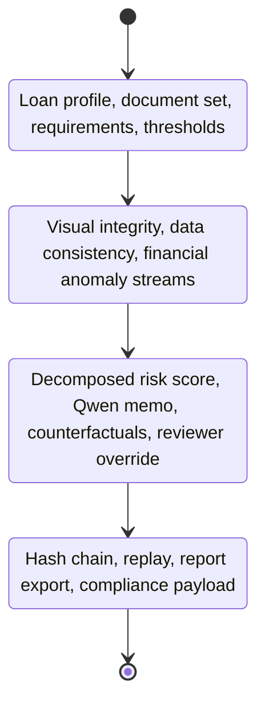

## Architecture

The application uses a FastAPI backend, a React/Vite frontend, WebSocket live updates, Three.js rendering for 3D scenes, Recharts-style analytical views, and a local Qwen runtime through Ollama. The backend is responsible for dynamic data generation, live connector status, source media resolution, document intelligence, flow intelligence, agent guardrails, and Qwen prompt routing. The frontend renders API state rather than owning hardcoded dashboard metrics.

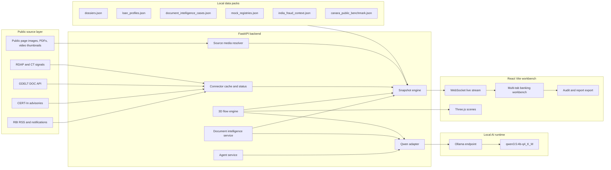

The system has been intentionally separated into small backend services. `sentinel_engine.py` builds the live workspace snapshot. `document_intelligence.py` handles loan-profile workflows, anomaly cards, risk decomposition, counterfactuals, override records, and audit export. `flow_engine.py` creates the local demo transaction and 3D graph state. `connectors.py` manages public-source freshness and stale/degraded status. `source_media.py` resolves images, PDFs, and video thumbnails from source pages. `qwen_runtime.py` and `qwen_adapter.py` keep the local model profile visible and bounded. `agent_service.py` receives active UI context and returns cited responses with only allowlisted actions.

The frontend mirrors that structure as an operator workspace. `App.tsx` owns the shell, tab routing, live stream handling, agent dock, upload controls, and window manager. `WorkspaceViews.tsx` renders the command, detection, radar, graph, financial, Qwen, and report surfaces. `Flow3DScenes.tsx` owns the interactive 3D fund-flow and entity graph scenes, including persistent camera behavior. `GraphTheoryBackdrop.tsx` provides the continuous animated graph-theory background. `styles.css` carries the Canara-inspired gradient visual system, responsive layout rules, and specialized chart, media, map, and card styling.

## Theme Coverage

The Theme 1 requirement is covered by a document-first workflow, but the prototype deliberately expands the evidence surface because real underwriting decisions rarely depend on one document alone. Land records are checked for survey number edits, area mismatches, revenue-stamp inconsistencies, and ownership-chain conflicts. Legal documents are treated as a visual and textual integrity problem, where signatures, witness fields, clauses, and dates can carry risk. Financial statements are analyzed through trends, materiality, circular transaction paths, cash spikes, and consistency with local demo GST/MSME baselines.

The result is a unified picture: a tampered land record can be connected to a borrower profile, a property region, a legal reference, a public-source signal, and a fund-flow anomaly. That is why the prototype includes document overlays, source media, maps, charts, 3D entity graphs, 3D transaction flows, Qwen reasoning, and audit export in the same workspace. The intent is to show an underwriting intelligence layer, not a single-purpose document viewer.

| Theme surface | How the prototype handles it | Human-review output |
| --- | --- | --- |
| Land records | Document overlays, registry-style source traces, collateral geography, ownership context | Branch verification, registrar escalation, collateral hold |
| Legal documents | Signature and clause anomaly cards, witness/reference checks, attention replay | Legal-cell review, specimen comparison, original-chain validation |
| Financial statements | Time-series anomaly, 3D fund-flow graph, circularity and materiality scoring | Statement recheck, GST/invoice verification, disbursement lock |

## Explainability

Explainability is not placed at the end of the workflow as a decorative summary. It is embedded into every major decision surface. Each anomaly has an identifier, severity, confidence, page region, observed fact, expected baseline, source trace, and evidence reference. The reasoning panel can shift between executive, standard, and forensic detail so the same finding can be read by a branch underwriter, a risk reviewer, or a technical evaluator.

The model is asked to explain compact evidence packs, not unbounded raw documents. This matters because the local Qwen 3.5 4B model is strong enough for grounded summarization, comparison, memo drafting, and agentic assistance, but it should not be treated as a vision/OCR model. The raw facts come from local deterministic/demo services; Qwen turns those facts into usable, cited language. When Qwen is missing, slow, or malformed, the backend falls back to deterministic summaries so the demo remains functional.

The audit trail extends that explainability into compliance. If a reviewer later asks why a score changed, why a branch escalation was recommended, or why an override was recorded, the relevant audit event can be replayed with the same anomaly identifiers, evidence identifiers, source traces, and hash chain context.

## AI Core

Qwen 3.5 4B is the prototype's local reasoning core. The default runtime target is `qwen3.5:4b-q4_K_M` through Ollama at `http://127.0.0.1:11434`. The default effective context is `4096`, with larger windows only appropriate when runtime telemetry indicates safe VRAM headroom. The model profile uses low-temperature, JSON-oriented, task-specific output budgets so document explanations, flow briefs, counterfactuals, and agent turns stay fast and bounded.

| Runtime field | Default value |
| --- | --- |
| Model | `qwen3.5:4b-q4_K_M` |
| Runtime | Ollama |
| Endpoint | `http://127.0.0.1:11434` |
| Context | `4096` default |
| Keep alive | `30m` |
| Privacy stance | Local-first reasoning |

The Qwen adapter compresses evidence before prompting, requests bounded JSON or bounded narrative where needed, validates expected structure, normalizes flow output fields, and produces deterministic fallback content when the model contract is not satisfied. This is designed for a hackathon setting where the model must feel central and useful without making the system fragile.

The agent follows the same principle. It is not an unrestricted chatbot bolted onto the UI. It receives active case, active tab, selected anomaly, selected document, selected flow path, selected entity node, open windows, filters, Qwen runtime state, connector provenance, and report state. It can answer questions and propose UI actions, but actions must pass an allowlist and schema validation before they affect the workspace.

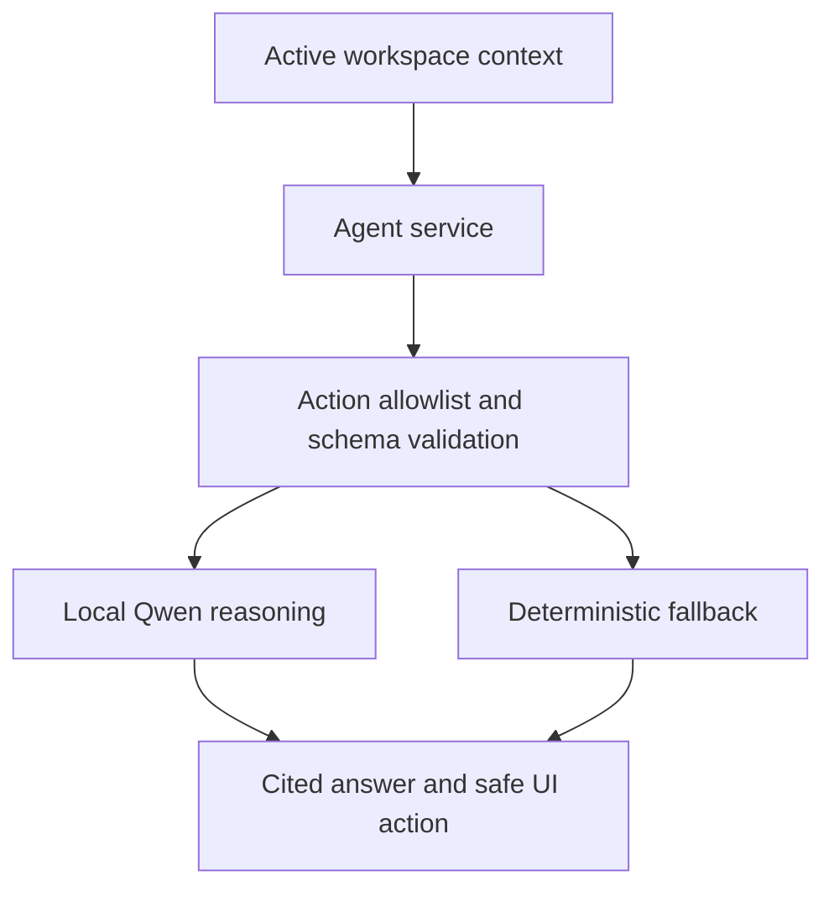

## Live Sources And Media

The prototype uses live public-source connectors where reachable and makes their state visible. Connector output can be fresh, stale, degraded, or unavailable, and the UI is expected to display that state instead of hiding it behind synthetic certainty. RBI, CERT-In, GDELT, Certificate Transparency, RDAP, and source-page media extraction are treated as public intelligence surfaces. They support underwriting context, but they do not replace primary document verification.

Media previews are resolved by the backend so the frontend does not invent preview content. The source media service extracts and ranks public page images, PDF previews, and video thumbnails, then returns a broader mix to reduce repeated cards. Upload-backed local media is also supported for image, PDF, and video evidence. Runtime preview caches stay under `data/cache/`, and uploaded evidence stays under `data/uploads/`; both are ignored because they are machine-local artifacts rather than source code.

## 3D Fund-Flow And Entity Intelligence

The Financials workspace uses a local demo transaction layer to recreate realistic fund-flow investigation without claiming access to production bank transaction data. The flow engine derives events from dossier risk, financial series, source pressure, and evidence context. It labels generated flow data as demo or dossier-derived, then sends the frontend nodes, links, paths, particles, and selected-path summaries.

Three.js is used directly for the fund-flow and entity graph scenes. The goal is to give evaluators a spatial sense of suspicious movement: borrower, account, branch, source, document, property, and counterparty nodes can be viewed as a live relationship space rather than as static bars. The latest 3D rendering logic preserves user camera movement, supports drag rotation and zoom, suspends auto-spin after manual interaction, and keeps animation loops bounded to avoid blank or unstable canvases.

Maps and 2D charts remain part of the intelligence layer, but they are supporting instruments. The strongest visual story is the combined path from a document anomaly, to source corroboration, to entity relationship, to suspicious financial movement, and finally to an audit-backed underwriting decision.

## Data And Provenance

The project keeps replaceable demo facts in `data/` so the frontend stays data-driven. `data/dossiers.json` defines the underwriting cases, borrowers, financial series, evidence media, and case posture. `data/loan_profiles.json` contains loan-category requirements and thresholds. `data/document_intelligence_cases.json` stores demo documents, anomalies, baselines, source traces, and attention paths. `data/mock_registries.json` provides explicitly local registry-style references. `data/india_fraud_context.json` carries report-derived Indian fraud criticality context. `data/canara_public_benchmark.json` maps public Canara-facing patterns to prototype innovations.

The project also has strict ignored runtime areas. `.env` is local configuration and is not committed. `data/cache/` contains connector and preview cache. `data/uploads/` contains local evidence uploads. `data/runtime/` contains logs, browser profiles, and smoke-test artifacts. Frontend build output, TypeScript build info, Python bytecode, virtual environments, and `node_modules` are excluded as generated artifacts.

| Data file | Role in the prototype |
| --- | --- |
| `data/dossiers.json` | Underwriting cases, borrower profiles, financial series, media references |
| `data/loan_profiles.json` | Loan profiles, document requirements, segment thresholds |
| `data/document_intelligence_cases.json` | Demo document pages, anomaly regions, baselines, attention paths |
| `data/mock_registries.json` | Local demo registry and internal-reference facts |
| `data/india_fraud_context.json` | Report-derived India document fraud context |
| `data/canara_public_benchmark.json` | Public Canara-system familiarity and innovation mapping |

## API Reference

The backend exposes a broad but coherent API surface. `/api/snapshot` and `/ws/live` are the main workspace channels. Connector and media endpoints support public-source refresh, source previews, uploaded evidence, and media catalogs. Qwen endpoints expose runtime status, warmup, case decision briefs, and flow briefs. Document intelligence endpoints handle loan profiles, ingestion, anomaly explanation, counterfactuals, reviewer override, and audit export. Agent endpoints manage context-aware turns and action validation.

| Method | Endpoint | Purpose |
| --- | --- | --- |
| `GET` | `/health` | Backend health |
| `GET` | `/api/snapshot` | Full live workspace snapshot |
| `WS` | `/ws/live` | Streaming snapshot updates |
| `GET` | `/api/connectors/status` | Connector freshness, provenance, and degraded states |
| `POST` | `/api/connectors/refresh` | Public connector refresh |
| `GET` | `/api/media/catalog` | Uploaded media catalog |
| `POST` | `/api/media/upload` | Upload image, PDF, or video evidence |
| `GET` | `/api/source-media/resolve` | Resolve public source media previews |
| `GET` | `/api/qwen/runtime` | Local model telemetry and optimized profile |
| `POST` | `/api/qwen/warm` | Keep local model resident |
| `POST` | `/api/qwen/decision-brief` | Qwen-backed case decision support |
| `POST` | `/api/qwen/flow-brief` | Qwen-backed fund-flow explanation |
| `GET` | `/api/document-intel/profiles` | Loan profile metadata |
| `POST` | `/api/document-intel/ingest` | Build or refresh document workflow |
| `POST` | `/api/document-intel/explain` | Explain a selected anomaly |
| `POST` | `/api/document-intel/counterfactual` | Compute and explain risk deltas |
| `POST` | `/api/underwriting/override` | Record human decision or disagreement |
| `GET` | `/api/audit/export` | Compliance-ready audit payload |
| `GET` | `/api/flow/live` | Focused transaction/fund-flow state |
| `POST` | `/api/agent/turn` | Context-aware assistant response |
| `POST` | `/api/agent/action` | Validate or execute allowlisted action |

## Repository Structure

The repository is organized as a conventional full-stack prototype. Backend services live under `backend/app/services`, data packs live under `data`, documentation lives under `docs`, the React application lives under `frontend`, and root scripts coordinate local development.

```text
SuRaksha/
|-- backend/
|   |-- requirements.txt
|   `-- app/
|       |-- main.py
|       |-- dev_server.py
|       `-- services/
|           |-- agent_service.py
|           |-- connectors.py
|           |-- data_provider.py
|           |-- document_intelligence.py
|           |-- flow_engine.py
|           |-- media_store.py
|           |-- qwen_adapter.py
|           |-- qwen_runtime.py
|           |-- runtime_config.py
|           |-- sentinel_engine.py
|           `-- source_media.py
|-- data/
|   |-- canara_public_benchmark.json
|   |-- document_intelligence_cases.json
|   |-- dossiers.json
|   |-- india_fraud_context.json
|   |-- loan_profiles.json
|   `-- mock_registries.json
|-- docs/
|   |-- implementation-slice.md
|   `-- qwen-performance.md
|-- frontend/
|   |-- package.json
|   |-- vite.config.ts
|   `-- src/
|       |-- App.tsx
|       |-- Flow3DScenes.tsx
|       |-- GraphTheoryBackdrop.tsx
|       |-- WorkspaceViews.tsx
|       |-- lib/api.ts
|       |-- styles.css
|       `-- types.ts
|-- scripts/
|   `-- start-frontend.mjs
|-- .env.example
|-- .gitignore
|-- package.json
`-- README.md
```

## Run Locally

The prototype expects Node.js for the React/Vite frontend and Python for the FastAPI backend. Install frontend dependencies from the root with:

```powershell
npm run install:frontend
```

Install backend dependencies with:

```powershell
python -m pip install -r backend/requirements.txt
```

Create a local environment file by copying the example configuration:

```powershell
Copy-Item .env.example .env
```

The default local setup uses the frontend at `http://127.0.0.1:5173`, the backend at `http://127.0.0.1:8001`, and Ollama at `http://127.0.0.1:11434`. The `.env.example` file is already aligned to those ports, including `VITE_API_BASE=http://127.0.0.1:8001`.

Start the backend from the repository root:

```powershell
npm run dev:backend
```

Start the frontend in another terminal:

```powershell
npm run dev:frontend
```

Open the Vite URL, normally `http://127.0.0.1:5173`.

For the local AI core, install and start Ollama, then pull the configured model:

```powershell
ollama pull qwen3.5:4b-q4_K_M
ollama ps
```

The UI can still run when Qwen is unavailable, but Qwen-backed explanations, flow briefs, and agent turns will use deterministic fallback behavior.

## Validation

The main validation command builds the frontend and compiles the backend Python modules:

```powershell
npm run check
```

Useful backend smoke checks are:

```powershell
Invoke-RestMethod http://127.0.0.1:8001/health
Invoke-RestMethod http://127.0.0.1:8001/api/snapshot
Invoke-RestMethod http://127.0.0.1:8001/api/connectors/status
Invoke-RestMethod http://127.0.0.1:8001/api/qwen/runtime
```

For a complete demo pass, the frontend should render without horizontal overflow on desktop and mobile, the Explainable Detection workflow should update when loan profile and anomaly selections change, media previews should not show broken images, 3D scenes should remain nonblank and preserve camera movement, and the agent dock should answer with citations while refusing unsupported actions. The Qwen runtime should report the configured model, effective context, optimized task profile, and fallback state clearly.

## Operational Workarounds And Fallbacks

The prototype is designed to keep the demo usable even when one live dependency is weak. If a public connector times out, the backend keeps the latest usable cache as stale context and exposes the stale or degraded state in the UI. It does not silently rename stale data as fresh live intelligence. This is important for evaluator trust because a banking prototype should be honest about source quality.

If source media extraction cannot embed a public page image, PDF, or video thumbnail directly, the source media service falls back through proxy, PDF preview, page preview, and source-profile representations. The UI still labels the preview by media kind and provenance so a reviewer can tell the difference between a direct thumbnail, a circular/PDF representation, and a connector evidence profile. Uploaded evidence remains available through the local media catalog when public media is unavailable.

If Qwen is not running, not resident, slow, or returns malformed JSON, the document explanation, flow brief, memo, counterfactual, audit replay, and agent response paths use deterministic fallback text. The fallback is deliberately less ambitious than a model response, but it preserves citations, evidence IDs, and reviewer next actions so the workflow does not collapse during a demo.

If WebGL is unavailable or a 3D scene cannot initialize, the financial and entity surfaces are expected to fall back to enhanced 2D summaries and selected-path details rather than showing a blank canvas. When WebGL is available, user camera movement is preserved so dragging or zooming the 3D scene does not immediately snap back to the default view.

If local ports are changed, the backend and frontend must move together. The repository defaults to backend `8001`, frontend `5173`, and Ollama `11434`; changing `BACKEND_PORT` also requires updating `BACKEND_ORIGIN` and `VITE_API_BASE` in `.env`. This explicit port configuration is the workaround for the common local-development failure where the frontend is healthy but points at an old backend.

## Demo Narrative

The strongest seven-minute demo starts with a Canara branch underwriting context. The presenter selects a high-risk agricultural or MSME case, shows that public sources and local Qwen are active, and explains that the application is built for human decision support rather than automatic rejection.

The second moment is document ingestion. The evaluator sees the selected loan profile, the required document set, and the streaming processing language. This creates confidence that the system is profile-aware rather than running generic checks.

The third moment is the document anomaly itself. The presenter clicks a highlighted region, opens the reasoning panel, shows the observed fact, baseline, confidence, source trace, and attention replay, then asks Qwen for a concise explanation. The key message is that every alert has a reason and an evidence trail.

The fourth moment moves from document risk to financial movement. The presenter switches to the Financials surface, selects a suspicious fund path in the 3D scene, and requests a Qwen flow brief. This demonstrates that the prototype can connect document tampering to financial behavior instead of treating them as separate dashboards.

The final moment is governance. The presenter runs a counterfactual, records a reviewer action or override, opens the audit trail, and exports the compliance payload. The close is simple: SuRaksha Sentinel is not just detecting anomalies; it is making the underwriting decision explainable, reviewable, and auditable.

## Public Reference Boundary

The prototype was shaped around the HackerEarth Theme 1 statement and public banking/security references. The public Canara references include Digital Security, MSME Cap, public loan/fair-lending material, and cyber-awareness material. Regulator and source-intelligence context includes RBI RSS, CERT-In advisories, GDELT data/API material, Certificate Transparency, and RDAP-style public source checks.

The important boundary is that these references inspire the workflow and benchmark mapping; they are not evidence of internal Canara integration. Demo finance-flow and registry data remain local, replaceable, and explicitly labeled. Live public connectors keep provenance and freshness visible.

| Reference | URL |
| --- | --- |
| Hackathon Theme 1 | <https://www.hackerearth.com/community/challenges/hackathon/sukaksha-cyber-hackathon-2/> |
| Canara Digital Security | <https://canarabank.com/pages/DigitalSecurity> |
| Canara MSME Cap | <https://canarabank.bank.in/pages/Canara-MSME-Cap> |
| Canara Loan Policy / fair lending material | <https://canarabank.bank.in/pages/Loan-Policy> |
| RBI RSS | <https://www.rbi.org.in/Scripts/rss.aspx> |
| CERT-In advisories | <https://www.cert-in.org.in/s2cMainServlet?pageid=PUBADVLIST> |
| GDELT data/API overview | <https://www.gdeltproject.org/data.html> |

## Privacy, Ethics, And Scope

SuRaksha Sentinel is defensive underwriting decision support. It is designed to help a bank reviewer inspect evidence, understand risk, and record accountable decisions. It should not be used for private-account scraping, credential bypassing, unsourced allegations, autonomous borrower rejection, or covert surveillance.

The local-first Qwen setup is central to that boundary. Sensitive borrower documents should not need to leave the machine or a trusted internal environment. Public-source intelligence is used only with visible provenance. Demo data is labeled as demo data. Human review remains the final authority, and reviewer disagreement is treated as useful feedback rather than an error to hide.

## Troubleshooting

Most local failures come from port mismatch, a stopped backend, a stale `.env`, or an unavailable Qwen runtime. If the frontend fetches fail, confirm that `VITE_API_BASE` points to `http://127.0.0.1:8001` and that the backend is running. If Qwen features fall back, run `ollama ps`, confirm that `qwen3.5:4b-q4_K_M` is available, then use the warm endpoint or Qwen Ops surface. If media previews look sparse, refresh connectors and remember that source preview caches are intentionally local under `data/cache/`. If a 3D scene is blank, check WebGL support; the UI is expected to fall back gracefully rather than leaving an empty work area.

Generated files are intentionally ignored. Python bytecode, frontend build output, `node_modules`, `.env`, upload folders, connector caches, browser smoke profiles, and runtime logs should not be committed. New case facts should go into the structured data packs under `data/`, while new backend behavior should generally live in a focused service under `backend/app/services/`.
