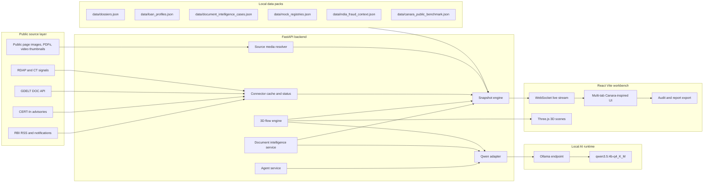
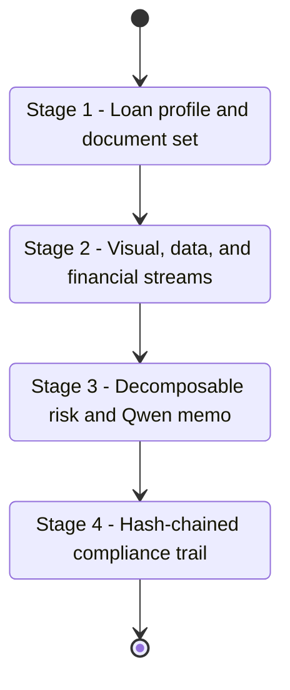
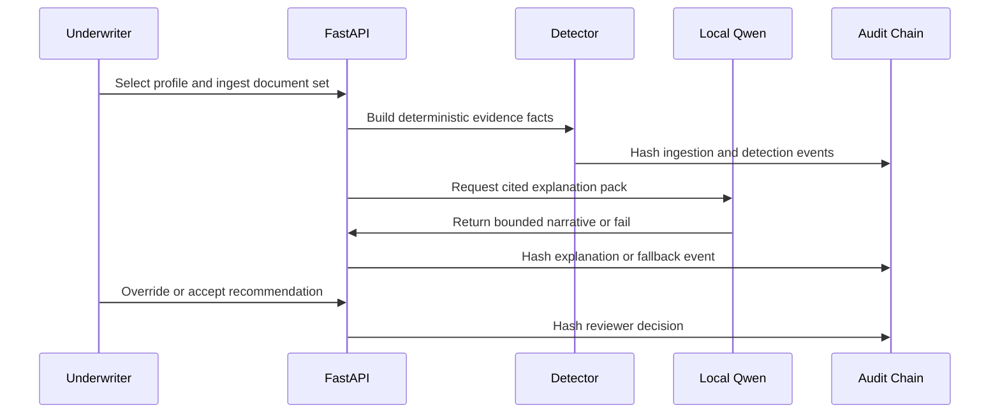
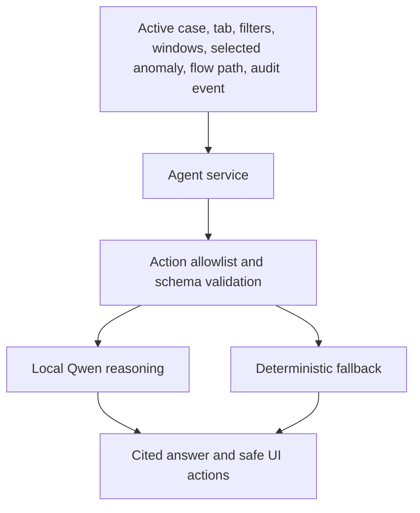

# SuRaksha Sentinel

<p align="center">
  
  
  
  
</p>

<p align="center">
  <b>Canara-inspired explainable underwriting intelligence for real-time document, source, entity, and fund-flow anomaly detection.</b>
</p>

SuRaksha Sentinel is a full-stack hackathon prototype for the SuRaksha Cyber Hackathon Theme 1 problem: detecting tampering, changes, and forgery attempts across land records, legal documents, and financial statements in real time, then turning the detection evidence into transparent underwriting decisions.

The prototype is not a clone of Canara Bank systems and does not claim access to Canara internal data. It is a Canara-familiar workbench shaped around public banking patterns: digital lending, branch underwriting, fraud monitoring, compliance trails, borrower verification, and regulator-ready decision support.

The README diagrams below are Mermaid architecture diagrams generated from this repository. They are schematic documentation, not screenshots and not fictional UI captures.

## Contents

- [What It Solves](#what-it-solves)
- [Experience Summary](#experience-summary)
- [System Architecture](#system-architecture)
- [Four-Stage Demo Flow](#four-stage-demo-flow)
- [Core Capabilities](#core-capabilities)
- [Qwen 3.5 4B AI Core](#qwen-35-4b-ai-core)
- [Data Packs And Provenance](#data-packs-and-provenance)
- [API Surface](#api-surface)
- [Repository Structure](#repository-structure)
- [Run Locally](#run-locally)
- [Validation](#validation)
- [Demo Script](#demo-script)
- [Privacy, Ethics, And Scope](#privacy-ethics-and-scope)
- [Troubleshooting](#troubleshooting)

## What It Solves

Banks need to make faster underwriting decisions without weakening fraud controls. Theme 1 asks for real-time anomaly detection across:

| Document family | Prototype focus | Explainable output |
| --- | --- | --- |
| Land records | Survey number edits, area mismatch, revenue stamp issues, ownership-chain inconsistency | Document overlays, source-of-truth trace, branch action |
| Legal documents | Signature mismatch, backdated notarization, altered clauses, missing witness requirements | Visual integrity stream, reference comparison, confidence calibration |
| Financial statements | Doctored totals, circular transactions, revenue spikes, suppressed expenses | Fund-flow path, financial trend anomaly, Qwen memo |

The system is designed for human review. It does not silently reject borrowers. It gives underwriters a clear explanation of what was flagged, why it matters, what evidence supports it, and what action should happen next.

## Experience Summary

The application runs as a Canara-inspired multi-tab underwriting command center:

| Workspace tab | Purpose |
| --- | --- |
| Command Center | Portfolio posture, current case, risk index, benchmark mapping, live media/source intelligence |
| Explainable Detection | Primary Theme 1 workflow: ingestion, document overlay, anomaly reasoning, risk decomposition, audit trail |
| Signal Radar | Public-source intelligence with provenance, freshness, media previews, stale/degraded states |
| Entity Graph | 2D and 3D relationship analysis across borrower, documents, branch, source, property, account, and counterparty nodes |
| Financials | Live demo transaction layer, 3D fund-flow tracker, anomaly ledger, Qwen flow explanations |
| Qwen Ops | Local model status, GPU residency, context budget, warmup, task profiles, deterministic fallback state |
| Report Center | Decision package, audit export, source citations, reviewer next actions |

The interface includes:

- Canara-style blue/yellow banking palette with gradient surfaces.
- Smooth graph-theory background animation across the prototype.
- Live media preview mosaics for public-source images, PDFs, and video thumbnails.
- Multi-window investigation surfaces for dossiers, source feeds, 3D flow, entity graph, Qwen console, report builder, and media viewer.
- Context-aware local agent dock that can perform only allowlisted UI actions.

## System Architecture



## Four-Stage Demo Flow



### Stage 1: Unified Document Ingestion

The underwriter selects a loan profile such as agricultural land mortgage, MSME working capital, retail home loan, or corporate credit. The backend loads the profile thresholds, required documents, local demo registry references, and case-specific dossier context.

The UI streams natural-language processing progress, for example:

```text
Classifying land collateral file
Extracting survey number and area facts
Cross-checking demo Bhoomi-style registry
Running visual integrity stream
Preparing explainability cards
Hashing audit event
```

### Stage 2: Real-Time Anomaly Detection

The Explainable Detection workbench is built around two synchronized panels:

- Document viewer with color-coded anomaly overlays and attention replay paths.
- AI reasoning panel with "Why this?", confidence calibration, expected baseline, source trace, and reviewer action.

The backend emits three evidence streams:

| Stream | What it checks |
| --- | --- |
| Visual Integrity | Tamper heat, stamp inconsistency, copy/paste artifacts, signature anomalies, font/scan mismatch |
| Data Consistency | Borrower names, dates, PAN-like identifiers, survey numbers, property IDs, registry facts |
| Financial Anomaly | Circular fund flow, unusual deposits, statement mismatch, margin deviation, materiality spikes |

### Stage 3: Explainable Underwriting Risk

The composite risk score is decomposed by fixed underwriting weights:

| Component | Weight |
| --- | ---: |
| Document Authenticity | 30% |
| Data Veracity | 25% |
| Financial Integrity | 25% |
| Source Trustworthiness | 20% |

Each sub-score is clickable in the UI. Qwen provides bounded, cited explanation text when available. Deterministic fallback summaries are returned when Qwen is unavailable or produces malformed output.

### Stage 4: Tamper-Evident Audit Trail

Every workflow action is recorded as a local hash-chained audit event. This is a prototype-grade tamper-evident chain, not a public blockchain deployment.



## Core Capabilities

### Explainable Document Intelligence

- Loan-profile specific requirements and thresholds.
- Demo document intelligence cases for genuine and tampered dossiers.
- Page-level anomaly overlays with bounding boxes.
- Severity, confidence, baseline, source trace, and evidence IDs per anomaly.
- Attention replay sequence for selected findings.
- Counterfactual risk delta for "what if this anomaly were genuine or removed?".
- English, Hindi, and Kannada explanation setting support.

### Live Source And Media Intelligence

- Public-source connector status with provenance and freshness.
- Stale-if-error behavior instead of fake live claims.
- Source media resolver for public page images, PDFs, and video thumbnails.
- Preview proxy endpoints for source images and PDF/page previews.
- Upload-backed evidence catalog for local image, PDF, and video assets.
- Expanded media mosaics to reduce repeated preview appearance.

### 3D Fund-Flow And Entity Rendering

- Three.js fund-flow scene with risk-colored nodes and animated transaction paths.
- Entity graph scene for borrower, account, branch, property, document, source, and counterparty relationships.
- Persistent camera state so user rotation and zoom do not snap back immediately.
- Reduced-motion and WebGL fallback paths.
- Selected-path details and Qwen "explain this flow" support.

### Canara-Familiar Benchmark Layer

The benchmark panel maps public Canara-facing patterns to prototype innovation areas:

| Public pattern | Prototype improvement |
| --- | --- |
| Digital security and fraud monitoring | Explainable transaction and document anomaly workbench |
| Digital lending journeys | Loan-profile specific ingestion and decision support |
| MSME credit assessment | Financial anomaly stream and fund-flow ledger |
| Loan due diligence | Borrower, guarantor, document, source, and collateral checklist |
| Cyber awareness and compliance | Audit trail, source provenance, reviewer next actions |

Sources are public Canara/regulatory/security references only. The prototype does not claim any internal Canara architecture or data access.

### Context-Aware Local Agent

The copilot is not a free-form external chatbot. It receives active workspace context and can only propose or execute allowlisted actions:



Supported action families include selecting cases/documents/anomalies, switching tabs, opening windows, filtering signals, running counterfactuals, explaining flow paths, opening audit events, warming Qwen, and exporting reports.

## Qwen 3.5 4B AI Core

The prototype is tuned around local `qwen3.5:4b-q4_K_M` through Ollama.

| Setting | Default |
| --- | --- |
| Model | `qwen3.5:4b-q4_K_M` |
| Runtime | Ollama |
| Endpoint | `http://127.0.0.1:11434` |
| Context | `4096` default, higher only when runtime checks permit |
| Keep alive | `30m` |
| JSON mode | enabled |
| Output style | task-specific bounded budgets |
| Privacy boundary | local-only by default |

Qwen is used for:

- Anomaly explanation cards.
- Underwriting memo generation.
- Flow-path and entity-path explanations.
- Counterfactual summaries.
- Audit replay narratives.
- Agentic assistant responses.

Qwen is not treated as a vision/OCR model in this prototype. Deterministic local services generate the raw facts; Qwen explains and prioritizes those facts with citations.

## Data Packs And Provenance

Reusable demo and reference facts live under `data/` so the frontend does not own case metrics.

| File | Purpose |
| --- | --- |
| `data/dossiers.json` | Dossier cases, borrowers, financial series, media, risk posture |
| `data/loan_profiles.json` | Canara-style loan profiles, required document sets, thresholds |
| `data/document_intelligence_cases.json` | Demo document pages, anomalies, baselines, attention paths |
| `data/mock_registries.json` | Local demo registry and internal-reference facts, labeled `demo-local` |
| `data/india_fraud_context.json` | Report-derived India fraud criticality context |
| `data/canara_public_benchmark.json` | Public Canara-system familiarity and innovation map |

Ignored runtime directories:

| Path | Why ignored |
| --- | --- |
| `data/cache/` | Connector/media cache and public preview cache |
| `data/uploads/` | Uploaded local evidence |
| `data/runtime/` | Logs, browser smoke profiles, runtime artifacts |
| `.env` | Local ports and model/runtime settings |

## API Surface

### Core

| Method | Endpoint | Purpose |
| --- | --- | --- |
| `GET` | `/health` | Backend health |
| `GET` | `/api/snapshot` | Full live workspace snapshot |
| `WS` | `/ws/live` | Streaming snapshot updates |

### Connectors And Media

| Method | Endpoint | Purpose |
| --- | --- | --- |
| `GET` | `/api/connectors/status` | Connector status, freshness, errors |
| `POST` | `/api/connectors/refresh` | Refresh public connectors |
| `GET` | `/api/media/catalog` | Uploaded media catalog |
| `POST` | `/api/media/upload` | Upload image/PDF/video evidence |
| `GET` | `/api/media/uploaded/{filename}` | Serve uploaded evidence |
| `GET` | `/api/source-media/resolve` | Resolve source-backed media previews |
| `GET` | `/api/source-media/proxy` | Proxy source media preview |
| `GET` | `/api/source-media/pdf-preview` | Render or proxy PDF preview |
| `GET` | `/api/source-media/page-preview` | Render source page preview |

### Qwen And Agent

| Method | Endpoint | Purpose |
| --- | --- | --- |
| `GET` | `/api/qwen/runtime` | Runtime telemetry and task profile |
| `POST` | `/api/qwen/warm` | Warm local model |
| `POST` | `/api/qwen/decision-brief` | Case decision explanation |
| `POST` | `/api/qwen/flow-brief` | Fund-flow explanation |
| `POST` | `/api/agent/turn` | Context-aware assistant turn |
| `POST` | `/api/agent/action` | Validate or execute allowlisted action |

### Document Intelligence And Audit

| Method | Endpoint | Purpose |
| --- | --- | --- |
| `GET` | `/api/document-intel/profiles` | Loan profile metadata |
| `POST` | `/api/document-intel/ingest` | Start/refresh document workflow |
| `POST` | `/api/document-intel/explain` | Qwen-backed anomaly explanation |
| `POST` | `/api/document-intel/counterfactual` | Risk delta explanation |
| `POST` | `/api/underwriting/override` | Human decision and disagreement log |
| `GET` | `/api/audit/export` | Compliance-ready audit payload |
| `GET` | `/api/flow/live` | Focused transaction/fund-flow state |

## Repository Structure

```text
SuRaksha/
|-- backend/
|   |-- requirements.txt
|   `-- app/
|       |-- main.py
|       |-- dev_server.py
|       `-- services/
|           |-- agent_service.py
|           |-- connectors.py
|           |-- data_provider.py
|           |-- document_intelligence.py
|           |-- flow_engine.py
|           |-- media_store.py
|           |-- qwen_adapter.py
|           |-- qwen_runtime.py
|           |-- runtime_config.py
|           |-- sentinel_engine.py
|           `-- source_media.py
|-- data/
|   |-- canara_public_benchmark.json
|   |-- document_intelligence_cases.json
|   |-- dossiers.json
|   |-- india_fraud_context.json
|   |-- loan_profiles.json
|   `-- mock_registries.json
|-- docs/
|   |-- implementation-slice.md
|   `-- qwen-performance.md
|-- frontend/
|   |-- package.json
|   |-- vite.config.ts
|   `-- src/
|       |-- App.tsx
|       |-- Flow3DScenes.tsx
|       |-- GraphTheoryBackdrop.tsx
|       |-- WorkspaceViews.tsx
|       |-- lib/api.ts
|       |-- styles.css
|       `-- types.ts
|-- scripts/
|   `-- start-frontend.mjs
|-- .env.example
|-- .gitignore
|-- package.json
`-- README.md
```

## Run Locally

### 1. Install dependencies

```powershell
npm run install:frontend
python -m pip install -r backend/requirements.txt
```

### 2. Configure environment

```powershell
Copy-Item .env.example .env
```

The default local ports are:

| Service | URL |
| --- | --- |
| Frontend | `http://127.0.0.1:5173` |
| Backend | `http://127.0.0.1:8001` |
| Ollama | `http://127.0.0.1:11434` |

### 3. Prepare local Qwen

Install and start Ollama, then make sure the model is available:

```powershell
ollama pull qwen3.5:4b-q4_K_M
ollama ps
```

### 4. Start backend

```powershell
npm run dev:backend
```

### 5. Start frontend

```powershell
npm run dev:frontend
```

Open `http://127.0.0.1:5173`.

## Validation

Run the full local check:

```powershell
npm run check
```

Smoke-test the backend:

```powershell
Invoke-RestMethod http://127.0.0.1:8001/health
Invoke-RestMethod http://127.0.0.1:8001/api/snapshot
Invoke-RestMethod http://127.0.0.1:8001/api/connectors/status
Invoke-RestMethod http://127.0.0.1:8001/api/qwen/runtime
```

Qwen contract checks:

- Runtime model should report `qwen3.5:4b-q4_K_M`.
- Effective context should default to `4096`.
- Flow brief outputs should normalize `confidence` and `materialityScore` to `0-100`.
- `citations`, `nextChecks`, and `guardrails` should be arrays.
- Malformed or unavailable Qwen output should fall back to deterministic text.

Browser checks:

- No horizontal overflow on desktop or mobile.
- Explainable Detection renders the four-stage workflow.
- Source/media previews do not show broken images.
- 3D flow and entity scenes are nonblank and keep user camera movement.
- Agent dock answers with citations and refuses unsupported actions.

## Demo Script

### Minute 0-1: Canara-style context

Open Command Center as a branch underwriter. Show the active case, live source review, local Qwen state, and public Canara-system benchmark panel.

### Minute 1-2: Loan-profile ingestion

Switch to Explainable Detection. Select an agricultural land mortgage or MSME working capital profile. Run the demo ingestion flow and show required document mapping.

### Minute 2-4: Explainable anomaly

Click a highlighted document anomaly. Show the document overlay, "Why this?" explanation, confidence, baseline, source trace, and attention replay.

### Minute 4-5: Financial and 3D flow

Switch to Financials. Show the 3D fund-flow tracker, select a high-risk path, and request a Qwen flow explanation.

### Minute 5-6: Counterfactual and human review

Run a counterfactual to show how the risk score changes if an anomaly is removed. Record a human override or branch escalation decision.

### Minute 6-7: Audit export

Open the audit trail, show hash chaining, replay an event, and export the compliance-ready report payload.

## Privacy, Ethics, And Scope

This prototype is defensive underwriting decision support.

- It uses public-source connectors and local demo data packs.
- It does not claim access to Canara internal systems.
- It does not scrape private accounts or bypass authentication.
- It keeps Qwen local by default so sensitive borrower documents do not need to leave the machine.
- It labels demo-simulated finance-flow data and demo-local registries clearly.
- It presents AI findings as human-review evidence, not autonomous rejection decisions.

## Public Reference Boundary

The prototype was shaped around public-facing references and the hackathon theme, including:

- HackerEarth SuRaksha Cyber Hackathon Theme 1: <https://www.hackerearth.com/community/challenges/hackathon/sukaksha-cyber-hackathon-2/>
- Canara Digital Security: <https://canarabank.com/pages/DigitalSecurity>
- Canara MSME Cap: <https://canarabank.bank.in/pages/Canara-MSME-Cap>
- Canara Loan Policy / fair lending material: <https://canarabank.bank.in/pages/Loan-Policy>
- RBI RSS: <https://www.rbi.org.in/Scripts/rss.aspx>
- CERT-In advisories: <https://www.cert-in.org.in/s2cMainServlet?pageid=PUBADVLIST>
- GDELT data/API overview: <https://www.gdeltproject.org/data.html>

## Troubleshooting

| Symptom | Check |
| --- | --- |
| Frontend fetch failures | Confirm `.env` has `VITE_API_BASE=http://127.0.0.1:8001` and backend is running |
| Backend port conflict | Change `BACKEND_PORT` in `.env`, then update `BACKEND_ORIGIN` and `VITE_API_BASE` |
| Qwen unavailable | Run `ollama ps`, confirm model tag, then call `POST /api/qwen/warm` |
| Repeated stale connectors | Open `/api/connectors/status`; degraded sources are intentionally visible |
| Media previews missing | Refresh connectors and source media; uploaded evidence is under ignored `data/uploads/` |
| 3D scene blank | Check WebGL support; the app should fall back to enhanced 2D summaries |
| Build emits Python cache files | They are ignored by `.gitignore`; run `npm run check` normally |

## Development Notes

- Frontend metrics and visuals should render API state only.
- New demo facts should go into `data/`, not hardcoded frontend constants.
- Runtime cache and upload outputs must stay ignored.
- Keep Qwen prompts compact and cited; deterministic fallback must remain available for every AI-backed feature.
- Prefer adding focused services under `backend/app/services/` over expanding route handlers directly.

